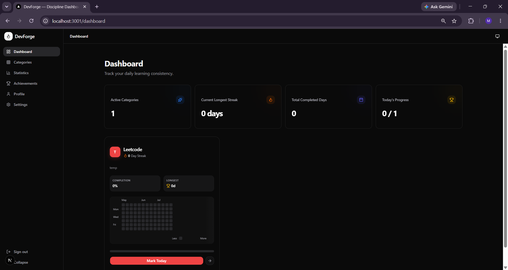
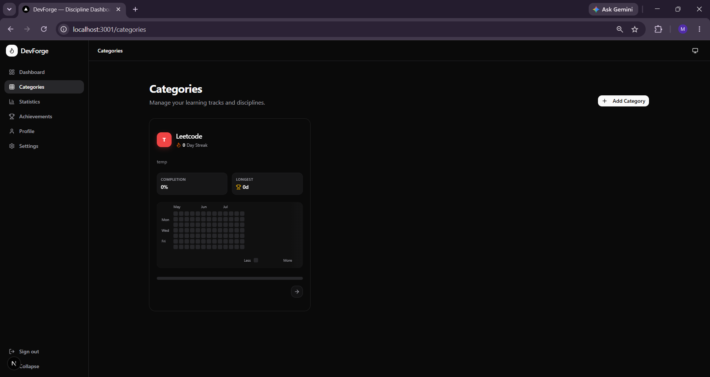
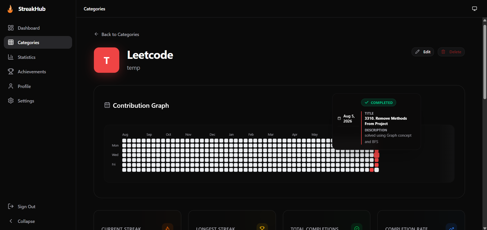
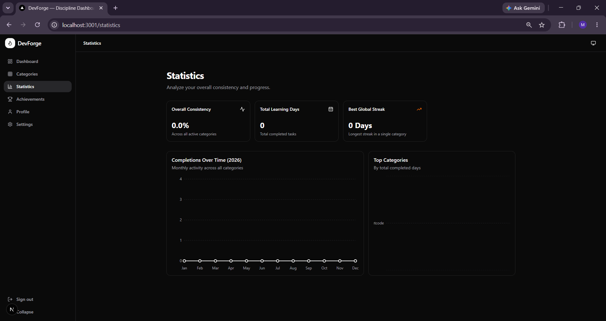
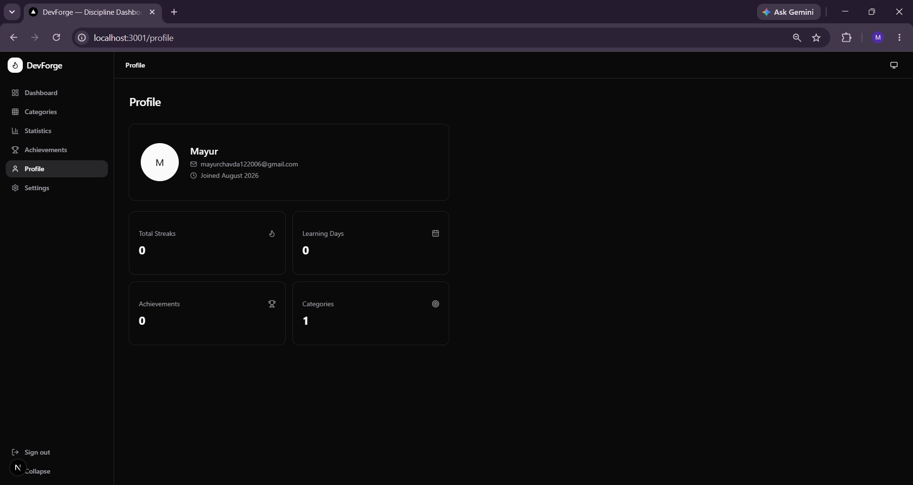

<div align="center">
  <br />
  <h1>🚀 DevForge</h1>
  <p>
    <strong>Build consistency. Track progress. Forge discipline.</strong>
  </p>
  <br />

  <!-- Badges -->
  <p>
    
    
    
    
    
    
    
    
    
  </p>
</div>

<br />

## 📖 Overview

**DevForge** is a premium, personal discipline and learning tracker designed specifically for developers. It helps you build daily consistency across technical skills and tracks your journey with beautiful visualizations. 

Whether you are grinding algorithms or learning new stacks, DevForge keeps you accountable across any technical discipline, including:

- LeetCode
- GitHub Commits
- DevOps
- AI & Machine Learning
- Data Science
- .NET, React, Laravel, MERN
- Docker & Kubernetes
- AWS & System Design
- Competitive Programming
- *...and custom learning categories tailored to your goals.*

---

## ✨ Features

- [x] **Secure Authentication**: Passwordless or traditional email authentication powered by Supabase.
- [x] **Personalized Dashboard**: A premium, 12-column responsive layout with real-time statistics.
- [x] **Contribution Heatmaps**: GitHub-style activity graphs to visualize your consistency over a 365-day rolling period.
- [x] **Daily & Longest Streak Tracking**: Sophisticated algorithm that guarantees accurate streak metrics.
- [x] **Category Management**: Create, edit, and delete custom tracks with distinct colors and icons.
- [x] **Real-time Statistics**: Live completion rates and goal tracking.
- [x] **Achievement System**: Unlockable badges for hitting milestones.
- [x] **Row Level Security (RLS)**: Fully protected PostgreSQL database ensuring data privacy.
- [x] **Beautiful Minimal UI**: High-end glassmorphic components and micro-interactions built with Framer Motion.
- [x] **Dark Mode**: Native, beautiful dark mode tailored for developers.

---

## 📸 Screenshots

### Dashboard

*A birds-eye view of your ongoing learning tracks and streaks.*

### Categories

*Manage and organize your distinct disciplines.*

### Category Details

*Dive deep into your performance with massive hero heatmaps and statistical insights.*

### Statistics

*Granular analytics on your consistency over time.*

### Profile

*View your achievements and manage your account.*

*(Note: Replace placeholders with actual screenshot paths)*

---

## 💻 Tech Stack

| Layer | Technology |
| --- | --- |
| **Frontend Framework** | Next.js 14 (App Router) |
| **UI Library** | React 18 |
| **Language** | TypeScript |
| **Styling** | Tailwind CSS |
| **Component System** | shadcn/ui |
| **Animations** | Framer Motion |
| **Icons** | Lucide React |
| **Backend & Auth** | Supabase |
| **Database** | PostgreSQL |
| **Deployment** | Vercel |

---

<details>
<summary><h2>📁 Project Structure</h2></summary>

```text
📦 DevForge
 ┣ 📂 src
 ┃ ┣ 📂 app
 ┃ ┃ ┣ 📂 (auth)        # Authentication routes (Login, Verify, Callback)
 ┃ ┃ ┣ 📂 (dashboard)   # Main application routes (Dashboard, Categories, Profile)
 ┃ ┃ ┣ 📂 api           # Next.js API routes
 ┃ ┃ ┗ 📜 layout.tsx    # Root layout and providers
 ┃ ┣ 📂 components
 ┃ ┃ ┣ 📂 categories    # Reusable category cards and dialogs
 ┃ ┃ ┣ 📂 heatmap       # GitHub-style calendar heatmap components
 ┃ ┃ ┣ 📂 shared        # Shared layouts, animated counters, page transitions
 ┃ ┃ ┗ 📂 ui            # Base shadcn/ui components
 ┃ ┣ 📂 features        # Feature-based domain logic and hooks
 ┃ ┣ 📂 hooks           # Shared React custom hooks
 ┃ ┣ 📂 lib             # Utility functions and Supabase clients
 ┃ ┣ 📂 services        # Server actions and database interactions
 ┃ ┗ 📂 types           # Global TypeScript interfaces
 ┣ 📂 supabase
 ┃ ┗ 📂 migrations      # PostgreSQL schemas and RLS policies
 ┣ 📜 tailwind.config.ts
 ┣ 📜 next.config.ts
 ┗ 📜 package.json
```

</details>

---

## 🗄️ Database Schema

The PostgreSQL backend handles all relational logic securely using Row Level Security (RLS):

- **`profiles`**: Extends the `auth.users` table with user metadata (avatars, full names).
- **`categories`**: Tracks distinct learning paths. Includes pre-computed aggregate fields (like `current_streak` and `longest_streak`).
- **`daily_entries`**: A chronological record of every daily check-in (category_id, user_id, entry_date).
- **`achievements`**: Global repository of unlockable badges (e.g., "100 Days of LeetCode").
- **`user_achievements`**: A bridge table representing when a specific user unlocked a specific achievement.
- **`reminders`**: Configurable push/email reminders.
- **`activity_logs`**: Audit trail of major user events.

---

<details>
<summary><h2>⚙️ Installation</h2></summary>

Follow these instructions to set up DevForge locally.

1. **Clone the repository:**
   ```bash
   git clone https://github.com/Mayur142-CODE/DevForge.git
   cd DevForge
   ```

2. **Install dependencies:**
   ```bash
   npm install
   ```

3. **Set up Environment Variables:**
   Create a `.env.local` file in the root directory:
   ```bash
   touch .env.local
   ```
   Add your Supabase credentials:
   ```env
   NEXT_PUBLIC_SUPABASE_URL=your-supabase-url
   NEXT_PUBLIC_SUPABASE_ANON_KEY=your-supabase-anon-key
   ```

4. **Initialize Database:**
   Run the SQL migration script located at `supabase/migrations/001_initial_schema.sql` inside your Supabase project's SQL Editor.

5. **Run the development server:**
   ```bash
   npm run dev
   ```

6. Open [http://localhost:3000](http://localhost:3000) in your browser.

</details>

---

## 🔑 Environment Variables

| Variable | Required | Description |
| --- | --- | --- |
| `NEXT_PUBLIC_SUPABASE_URL` | Yes | The URL of your Supabase project. |
| `NEXT_PUBLIC_SUPABASE_ANON_KEY` | Yes | The public anon key for secure frontend queries. |

---

## 🎮 Usage

- **Register / Login**: Sign up via the magical secure email link or standard password login. 
- **Create Category**: Head to the dashboard, click "Add Category", pick an icon, color, and set your goals.
- **Mark Today's Progress**: On any category card, simply click the "Check In" button. Your heatmap and streak will update instantly.
- **Track Streak**: View your Current Streak, Longest Streak, and Total Completion Rate on the Category Details page.
- **View Statistics**: Monitor your progress across months and analyze your most productive days.
- **Unlock Achievements**: Maintain your streaks to dynamically unlock badges like "Year Legend" or "Git Machine".

---

## 🔥 Streak Logic

DevForge uses a highly strict, accurate streak calculation algorithm:

- **One completion per category per day**: You can only check in once per day for a specific category.
- **Immediate Feedback**: Completing today *immediately* increases your current streak. You don't have to wait until tomorrow!
- **Grace Periods**: If you checked in yesterday, your streak is safe until midnight tonight.
- **Streak Breaks**: Missing exactly one day completely breaks your current streak, resetting it to 0. 
- **Preserved Records**: Your `Longest Streak` is immutable and will *never* decrease, even if you lose your current streak or accidentally uncheck a past date.

---

## 🤝 Contributing

Contributions are what make the open source community such an amazing place to learn, inspire, and create. Any contributions you make are **greatly appreciated**.

1. Fork the Project
2. Create your Feature Branch (`git checkout -b feature/AmazingFeature`)
3. Commit your Changes (`git commit -m 'Add some AmazingFeature'`)
4. Push to the Branch (`git push origin feature/AmazingFeature`)
5. Open a Pull Request

---

## 📜 License

Distributed under the MIT License. See `LICENSE` for more information.

---

## 👨‍💻 Author

**Mayur Chavda**

- GitHub: [@Mayur142-CODE](https://github.com/Mayur142-CODE)
- LinkedIn: [Your LinkedIn URL](#) *(Coming Soon)*
- Portfolio: [Your Portfolio URL](#) *(Coming Soon)*

---

<div align="center">
  <p>Built with ❤️ using Next.js, Supabase, and TypeScript.</p>
</div>
