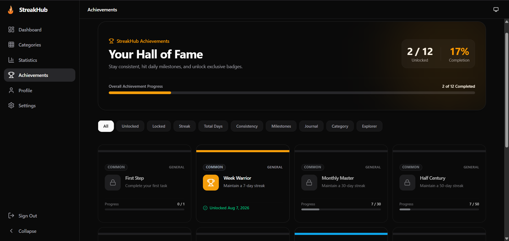

# 🔥 StreakHub

StreakHub is a personal discipline and consistency tracking platform designed to help developers build daily learning habits, maintain streaks, track progress, and celebrate achievements.

🚀 **Live Demo:** [https://streak-hub-ten.vercel.app/](https://streak-hub-ten.vercel.app/)

---

## ✨ Features

- 🔥 **Daily Streak Tracking**: Automatically calculates current and longest streaks to maintain momentum.
- 📊 **GitHub-Style Contribution Heatmaps**: Interactive heatmaps visualizing daily consistency and activity patterns.
- 📝 **Daily Learning & Activity Notes**: Attach descriptive notes and titles to your daily progress updates.
- 🔗 **Optional Resource Links**: Store relevant links (code repos, articles, documentation, PRs) for every check-in.
- 📈 **Statistics & Progress Tracking**: Real-time analytics, charts, completion percentages, and productivity metrics.
- 🏆 **Automatic Achievements**: Badges unlock dynamically as you hit streak milestones and completed day goals.
- 👤 **User Profile & Activity History**: Comprehensive activity log and milestone showcase attached to your user account.
- 📚 **Custom Learning Categories**: Organize work into personalized tracks (e.g., LeetCode, DevOps, AI/ML, System Design).
- 🔐 **Supabase Email Authentication**: Secure user registration and session management.
- 🎨 **Minimal Dark-Themed UI**: Sleek, modern dark UI designed for developer comfort.
- 📱 **Responsive Design**: Flawlessly optimized across mobile, tablet, and desktop viewports.
- 🌐 **Deployed on Vercel**: Lightning-fast global delivery powered by Vercel infrastructure.

---

## 📸 Screenshots

<div align="center">

### 📊 Dashboard
Overview of active categories, daily status, quick check-in actions, and overall contribution activity.


---

### 📚 Categories Management
Create, edit, organize, and inspect custom learning tracks with custom colors and icons.


---

### 🔍 Category Details & Heatmap
In-depth category view featuring category-specific contribution heatmaps, notes history, and metrics.


---

### 🏆 Automatic Achievements
Dynamic milestone badges unlocked through consistent streak building and completed activities.



---

### 👤 User Profile
Personalized user stats summary, unlocked achievements display, and profile settings.


---

### 📈 Statistics & Analytics
Comprehensive performance overview, charts, and activity breakdowns over time.


---

### 🔐 Authentication
Secure login and sign-up flow backed by Supabase Auth.


</div>

---

## 🧠 How It Works

1. **Create an Account**: Register securely via email authentication powered by Supabase.
2. **Create Learning / Discipline Categories**: Set up tracks tailored to your daily goals, such as:
   - LeetCode
   - GitHub
   - AI & Machine Learning
   - DevOps
   - .NET / Full Stack Development
   - System Design
   - Custom tracks
3. **Mark Completed for the Day**: Check in on your active categories daily.
4. **Enter Work Log**: Record your actual output with:
   - **Title**: A brief summary of what was accomplished.
   - **Description**: Detailed reflection or learning notes.
   - **Optional Resource Link**: Reference link to a GitHub PR, solution, or article.
5. **Record Contribution**: StreakHub saves and timestamp-logs your activity.
6. **Heatmap & Streak Update**: Your contribution is immediately plotted on your rolling heatmap.
7. **Automated Metrics**: Current streak, longest streak, and completion statistics recalculate automatically.
8. **Unlock Achievements**: Earn badges dynamically as your consistency builds up.

---

## 🔥 Streak System

- **Daily Progression**: Completing an activity on a given day advances your current streak.
- **Streak Break Logic**: If a required consecutive calendar day passes without a completion, your current streak resets to **0**.
- **Historical Best**: Your **Longest Streak** record is permanently preserved and will never decrease, even if a current streak is broken.
- **Visual Heatmap**: Contribution heatmaps map out actual logged days, giving you an authentic record of consistency.
- **Single-Day Aggregation**: Completing multiple categories on the same date counts as **ONE unique completed day** for overall platform activity heatmaps and global stats.

---

## 🏆 Achievements

StreakHub automatically evaluates activity metrics and grants milestone achievements without requiring manual claims. Unlocked achievements automatically synchronize with the user profile.

### Examples of Unlockable Badges:
- 🚀 **First Step**: Log your very first contribution.
- 🔥 **3-Day Streak**: Maintain consistency for 3 consecutive days.
- ⚡ **7-Day Streak**: Build a solid 1-week habit.
- 🏅 **30-Day Streak**: Reach a full month of continuous discipline.
- 🎯 **Completed Days Milestones**: Hit major milestones for total unique active days.
- 📚 **Category Milestones**: Reach target check-in counts within specific categories.
- 🧠 **Consistency Milestones**: Sustain long-term learning habits across multiple categories.

---

## 🛠️ Tech Stack

- **Framework**: [Next.js](https://nextjs.org/) (App Router, Server Actions)
- **Library**: [React](https://react.dev/)
- **Language**: [TypeScript](https://www.typescriptlang.org/)
- **Styling**: [Tailwind CSS](https://tailwindcss.com/) & [shadcn/ui](https://ui.shadcn.com/)
- **Authentication**: [Supabase Auth](https://supabase.com/auth)
- **Database**: [Supabase PostgreSQL](https://supabase.com/)
- **Animations**: [Framer Motion](https://www.framer.com/motion/)
- **Icons**: [Lucide Icons](https://lucide.dev/)
- **Data Visualization**: [Recharts](https://recharts.org/)
- **State & Data Management**: [Zustand](https://zustand-demo.pmnd.rs/) & [TanStack React Query](https://tanstack.com/query/latest)
- **Deployment**: [Vercel](https://vercel.com/)

---

## 🔐 Authentication & Backend

- **Supabase Auth**: Secure email/password login and registration.
- **PostgreSQL Database**: Relational schema engineered for user profiles, categories, daily check-in logs, and achievement tracking.
- **Isolated User Data**: All user activities and tracks are strictly scoped to the authenticated user ID.
- **Row Level Security (RLS)**: Enforced at the database level to ensure users can only query and mutate their own data.
- **Secret Protection**: All Supabase credentials and secret keys are stored securely using environment variables and are never exposed in public code.

---

## 🚀 Getting Started

### Prerequisites

Ensure you have Node.js (v18 or higher) and npm installed on your machine.

### Installation & Local Setup

1. **Clone the repository:**
   ```bash
   git clone https://github.com/Mayur142-CODE/StreakHub.git
   cd StreakHub
   ```

2. **Install dependencies:**
   ```bash
   npm install
   ```

3. **Configure Environment Variables:**
   Create a `.env.local` file in the root directory:
   ```env
   NEXT_PUBLIC_SUPABASE_URL=your_supabase_project_url
   NEXT_PUBLIC_SUPABASE_ANON_KEY=your_supabase_anon_key
   ```

4. **Start the Development Server:**
   ```bash
   npm run dev
   ```

5. Open [http://localhost:3000](http://localhost:3000) in your browser to view StreakHub.
